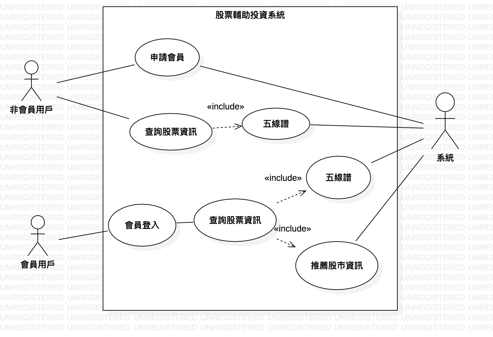
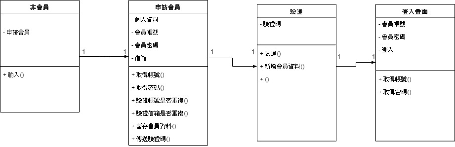
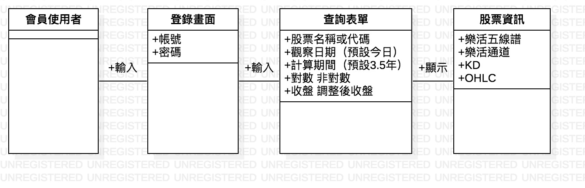
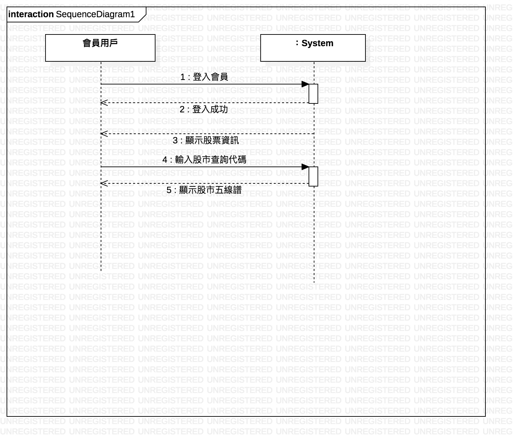
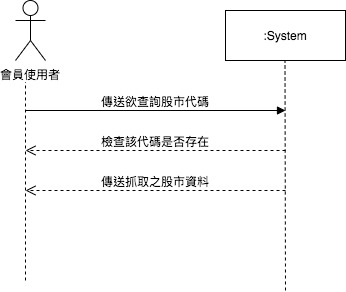
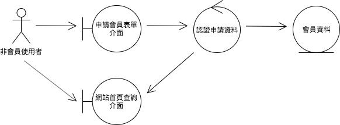
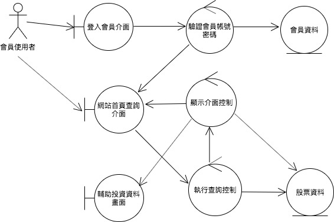
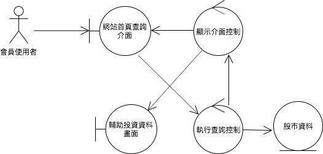
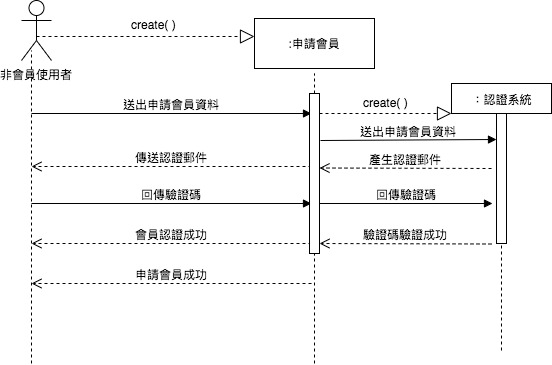

#### 專題名稱: 股票輔助投資系統

##### 小組成員:

* 0624025 黃樂昀
* `0624037 沈孟澤`
* 0624041 葉秦妤
 

### 專題需求：
     透過股票分析系統，讓使用者更簡易更快速的選擇可投資的公司。
### 功能性需求：
     1.告知買家在適當時間買賣股票
     2.繪製五線譜給用戶
### 非功能性需求：
    操作性：1.系統要能在隨身裝置上使用 2.介面簡潔容易使用
    效能：系統每10分鐘應該更新股市資料
    安全：系統採會員制，會員才能看到更進階的資訊
    文化與政策性：系統應該能夠看到部分國外股票
    
### 使用案例圖：


### 使用案例的重要性：
    1.非會員申請付費會員
    2.會員查詢股票資訊
    3.會員用戶查詢推薦股票之資訊
    4.會員登入
    5.非會員用戶/會員用戶 查詢樂活五線譜
### 使用案例：    
##### a.非會員申請會員
      1.客戶想要申請會員
      2.客戶點選申請會員
        2.1 填寫基本資料
      3.填寫完畢後送出申請資料
      4.收到系統傳送認證郵件
      5.申請者點選郵件連結
      6.會員認證成功
      7.申請會員成功
      
##### b.會員查詢股票資訊
      1.登入會員
      2.輸入要查詢的股票代碼
      3.輸入成功
      4.顯示股票重要資訊
##### c. 系統抓取會員查詢股票代碼之股市資料並傳送
      1.收到會員傳送欲查詢之股市代碼
      2.檢查該代碼是否存在
      3.利用爬蟲抓取該代碼所屬之股市資料
      4.傳送股市資料並繪製五線譜
### Users story：
     * 我是一個會員使用者，想要透過該系統查詢快速有用的股市資訊

### 初步類別圖：
#### 非會員申請會員

#### 會員查詢股票資訊

#### 系統抓取會員查詢股票代碼之股市資料並傳送


### 系統循序圖：
#### 非會員申請會員

#### 會員查詢股票資訊

#### 系統抓取會員查詢股票代碼之股市資料並傳送


### 強韌圖：
#### 非會員申請會員

#### 會員查詢股票資訊

#### 系統抓取會員查詢股票代碼之股市資料並傳送


### 循序圖：
#### 非會員申請會員



# 沈孟澤

## 學號: 0624037

### 資管系 三甲
###### `My First Assignment`

```
0624025 黃樂昀
0624037 沈孟澤
0624041 葉秦妤
```

[高科大](https://www.nkust.edu.tw/)


| Test1 | Test2 | Test3 |
|:------|:-----:|------:|
| 11111 | 22222 | 33333 |
| 111 | 222 | 333 |
| 11 | 22 | 33 |


:sunglasses:

:thumbsup:


