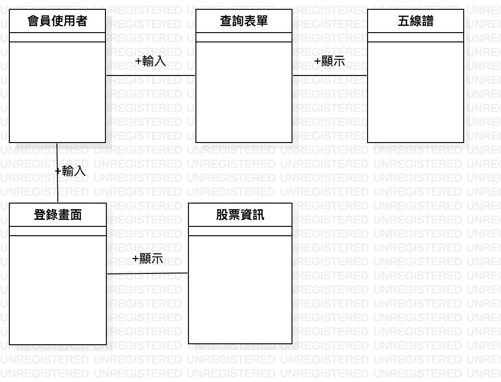
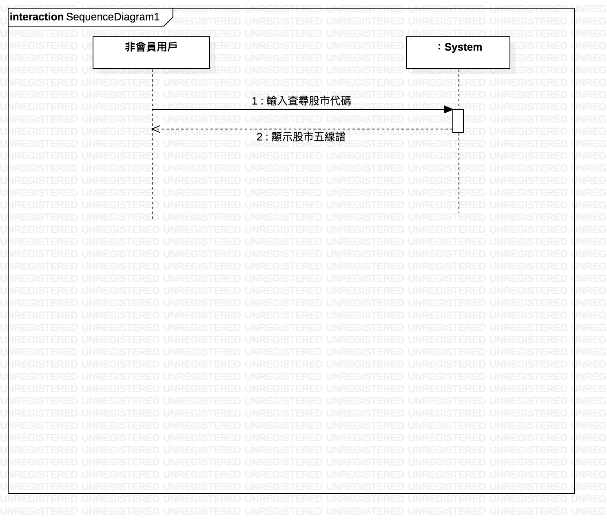

# 沈孟澤

## 學號: 0624037

### 資管系 三甲

#### 專題名稱: 股票輔助投資系統

##### 小組成員:

* 0624025 黃樂昀
* 0624037 沈孟澤
* 0624041 葉秦妤
 
###### `My First Assignment`

```
0624025 黃樂昀
0624037 沈孟澤
0624041 葉秦妤
```

[高科大](https://www.nkust.edu.tw/)


| Test1 | Test2 | Test3 |
|:------|:-----:|------:|
| 11111 | 22222 | 33333 |
| 111 | 222 | 333 |
| 11 | 22 | 33 |


:sunglasses:

:thumbsup:


## 功能性需求：
#### 1.告知買家在適當時間買賣股票
#### 2.繪製五線譜給用戶
#### 3.
## 非功能性需求：
### 操作性：1.系統要能在隨身裝置上使用 2.介面簡潔容易使用
### 效能：系統每10分鐘應該更新股市資料
### 安全：系統採會員制，會員才能看到更進階的資訊
### 文化與政策性：系統應該能夠看到部分國外股票







